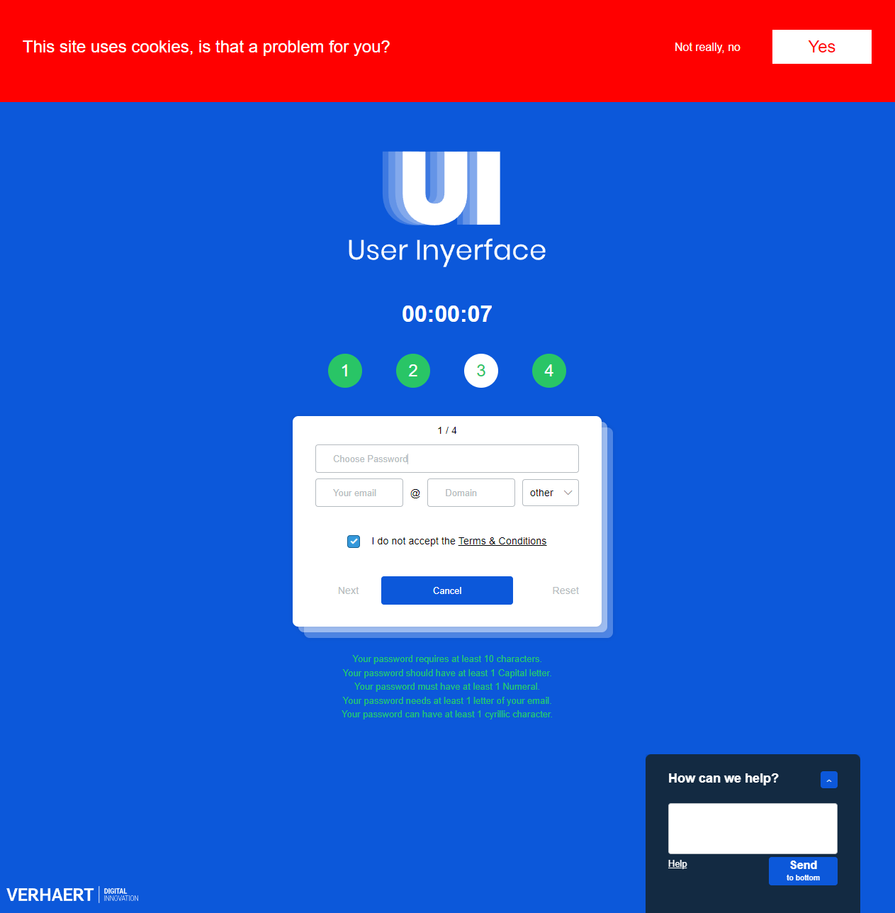
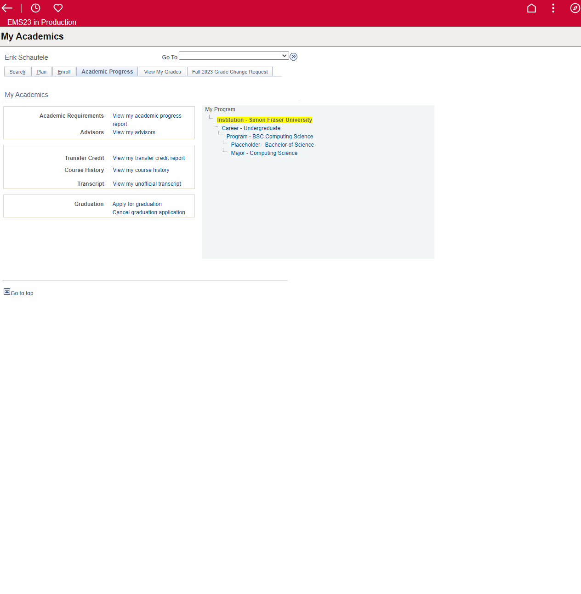
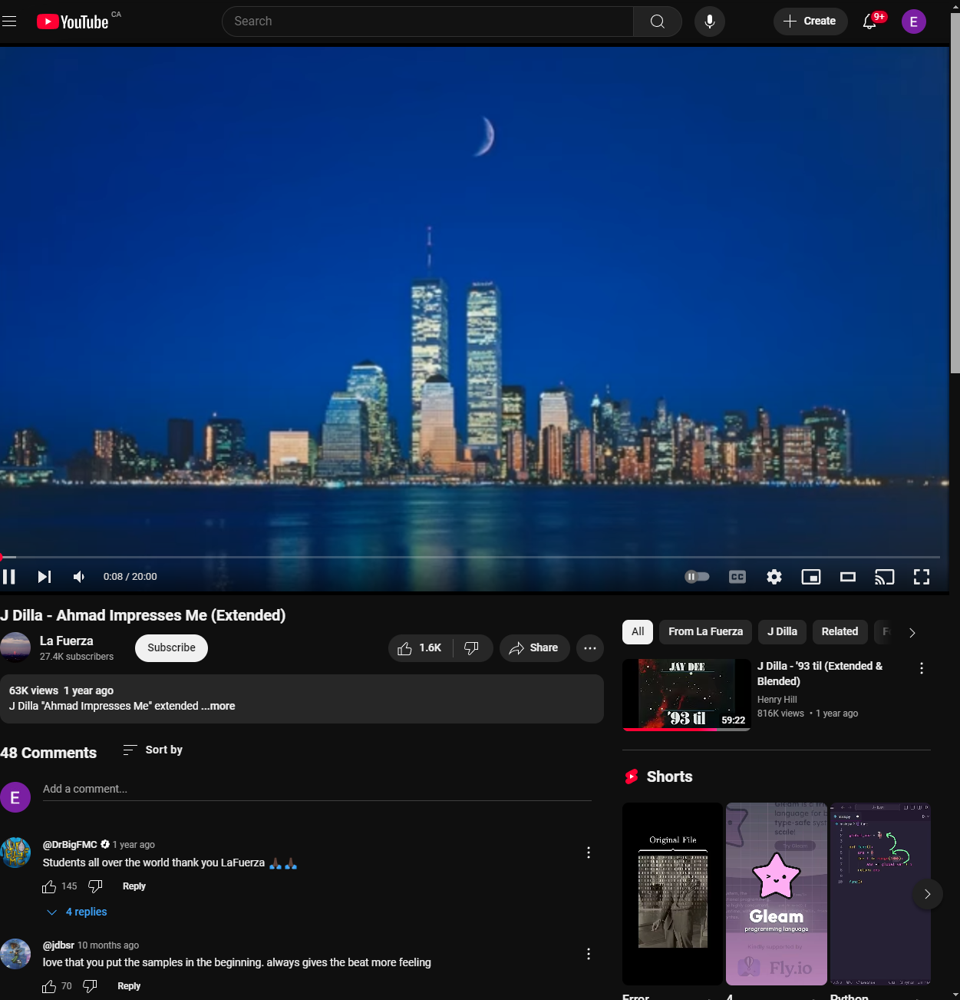

# 276-Lab3

# Interfaces Critique

This is an interface designed to be confusing. It is apart of a game on a website to try and fill in your details by a certain time. Overall is a fun challenge and a great example of exactly what not to do. 2 apects of this interface that are poor include the complete lack of clarity making it difficult to input information and the lack of coherent colours used as there is no proper centralized pallet used making the website seem identityless. 

This is the interface for gosfu specifically the academic progress page where academic progress, transcripts and more can be viewed. 2 aspects of this interface that are poor is the unclear and small text as it makes navigating the page and the corresponding pages it's linked to difficult to navigate (especially on mobile) along with the dated look of the website this makes it seem less secure and less professional.

This is the user interface of Netflix when watching a show (on pc). 2 aspects of this user interface that work well are it's simplistic yet recognizable icons and the consistent and basic color pallet. The icons are not overbearing when shown so they don't obstruct the view of the show and with a simple glance its easy to tell what each icon does (e.g. pause/play button, skip forward and back by 10 seconds, fullscreen, skip to next episode etc.) The color pallet only really includes: white, black and red with red being the stand out color making it easy to recognize the bar and how far into the show one is; this is the same sort of pallet throughout the site making it easy to tell from noticable the red accents that the user is watching Netflix.

# Heuristic Evaluation

# Github Video

