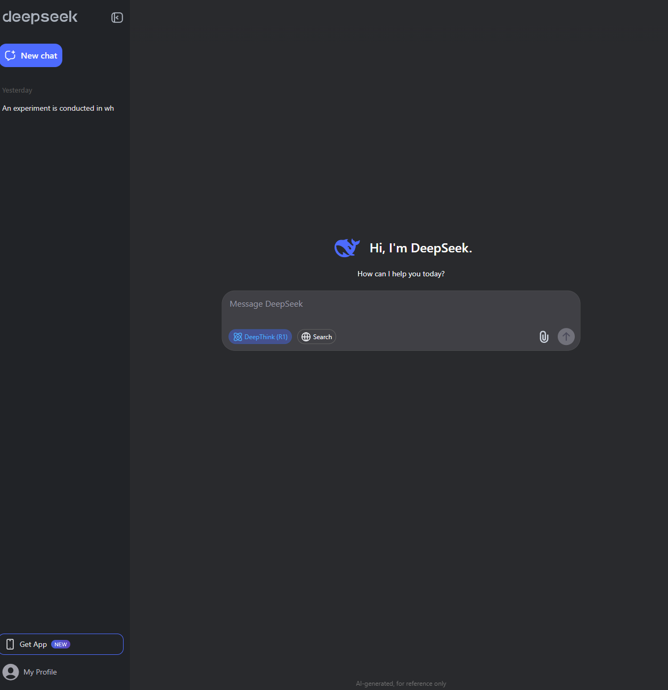
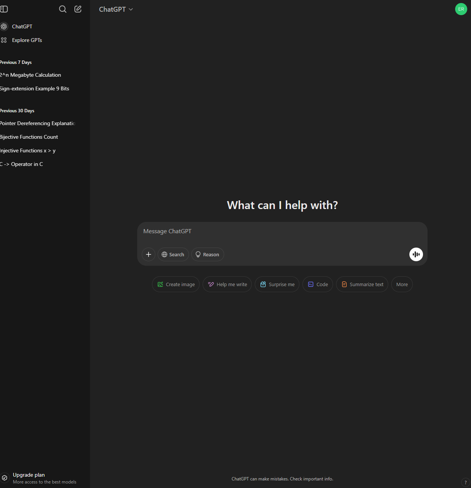

# 276-Lab3

# Interfaces Critique

This is an interface designed to be confusing. It is apart of a game on a website to try and fill in your details by a certain time. Overall is a fun challenge and a great example of exactly what not to do. 2 apects of this interface that are poor include the complete lack of clarity making it difficult to input information and the lack of coherent colours used as there is no proper centralized pallet used making the website seem identityless. 

This is the interface for gosfu specifically the academic progress page where academic progress, transcripts and more can be viewed. 2 aspects of this interface that are poor is the unclear and small text as it makes navigating the page and the corresponding pages it's linked to difficult to navigate (especially on mobile) along with the dated look of the website this makes it seem less secure and less professional.

This is the user interface of Netflix when watching a show (on pc). 2 aspects of this user interface that work well are it's simplistic yet recognizable icons and the consistent and basic color pallet. The icons are not overbearing when shown so they don't obstruct the view of the show and with a simple glance its easy to tell what each icon does (e.g. pause/play button, skip forward and back by 10 seconds, fullscreen, skip to next episode etc.) The color pallet only really includes: white, black and red with red being the stand out color making it easy to recognize the bar and how far into the show one is; this is the same sort of pallet throughout the site making it easy to tell from noticable the red accents that the user is watching Netflix.

This is the user interface for Youtube, specifically in theater mode. 2 aspects of this user interface that work well are the location of the different elements on screen and the color pallet used. Each element is placed strategically based on order of importance, the largest element placed in the center of the screen is the video itself to the right is the recomended videos for the viewer to easily select and below are the comments and video description. Elements are also placed familiar locations, such as the search bar near the top of the screen. The color pallet used is simplistic and is recognizable so that the viewer knows "they're watching Youtube".

This is the user interface for DeepSeek specifically it's effective homepage where a chat can be started. 
2 aspects of this user interface that are good are the color pallet used and the simple to understand elements. The blue color pallet helps differentiate DeepSeek in comparison to other AI chatbot sites such as ChatGPT. The elements of the sight are very easy to understand in that what you do is what you get an example of this is selecting DeepThink (R1) makes the model use the R1 deepthinking model, selecting search the web lets the AI search the web etc. 2 aspects of the site that I think are on the weaker end are the layout of elements and the emptyness of the site. The layout of the site is very similar to ChatGPT's a currently more well known chatbot. The site overall is simplistic and fairly empty giving it a lack of identity.

This is the user interface for ChatGPT. 2 aspects of this user interface that work well are its layout of elements and its simple yet intentional design. The layout of each element of the page is sensical and deliberate, the center of the screen and users attention is input for the chat and on the side are the previous chats along with exploring other models. ChatGPT's site is simple without many elements yet it never seems too barren, there are plenty of ways to input and element size keeps it easily readable yet not cluttered. 2 aspects I believe that could use some work include the lack of theme and the lack of clarity about what model is being used. The color pallet for ChatGPT is just a dull grey which although it neutral gives it less of an identity. Many different options are given on this page however to see what technical model you are talking too currently you need to go through unneccessary extra steps, I believe it should just be listed.

# Heuristic Evaluation

# Github Video

